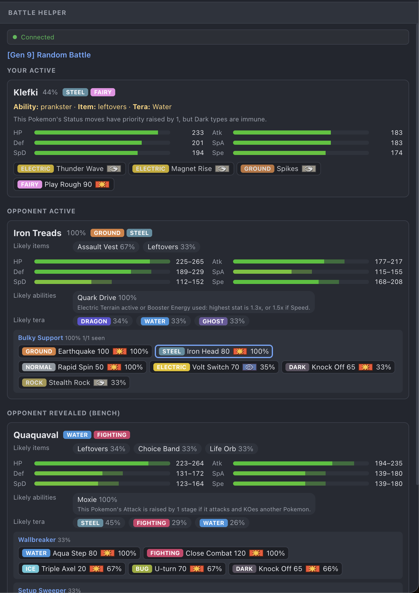
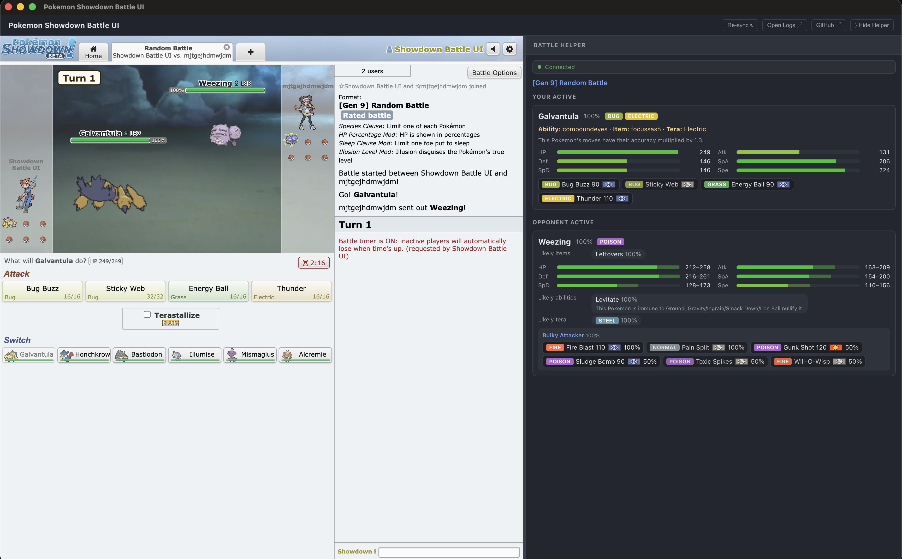
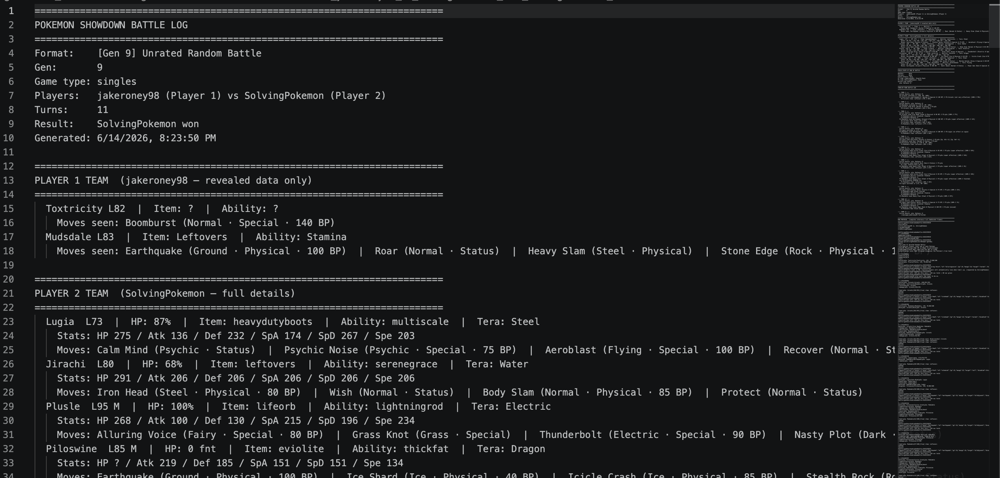

# ps-local

[](https://github.com/AbhishekR3/ps-local/actions/workflows/test.yml)
[](https://github.com/AbhishekR3/ps-local/actions/workflows/build-electron.yml)
[](https://github.com/AbhishekR3/ps-local/actions/workflows/build-linux.yml)
[](https://github.com/AbhishekR3/ps-local/actions/workflows/build-windows.yml)
[](https://github.com/AbhishekR3/ps-local/actions/workflows/build-macos.yml)
[](https://github.com/AbhishekR3/ps-local/actions/workflows/build-extension.yml)
[](https://app.codacy.com/gh/AbhishekR3/ps-local/dashboard?utm_source=gh&utm_medium=referral&utm_content=&utm_campaign=Badge_grade)

An Electron app that **automatically saves a rich battle log for every Pokémon Showdown battle** — a raw protocol dump plus a human-readable breakdown — with zero per-battle action. Play on the live `play.pokemonshowdown.com` ladder in a native docked window with an integrated battle helper panel that shows the opponent's predicted sets, stats, abilities, and Tera types live.



<!-- Screenshots to capture:
  1. docs/assets/panel.png     — helper panel mid-battle: predicted sets, stat bars, ability pills, Tera type
  2. docs/assets/battle-view.png — full window showing the PS client (left) + helper panel (right)
  3. docs/assets/log-sample.png  — a saved .txt battle log open in a text editor
-->

## Downloads

| Type | Platform | How to get |
|---|---|---|
| **Run from source** | Linux / Windows / macOS | `git clone` + `npm start` (see [Quickstart](#quickstart)) |
| **Chromium extension** | Chrome/Chromium (any OS) | CI artifacts → `build-chromium-extension` → download `ps-local-extension` → unzip → load unpacked |
| **macOS** installer (`.dmg`) + portable (`.zip`) | macOS | CI artifacts → `build-macos` → download `ps-local-macos-dmg` |
| **Windows** installer (`.exe`) + portable (`.exe`) | Windows | CI artifacts → `build-windows` → download `ps-local-windows-installer` |
| **Linux** AppImage + portable (`.tar.gz`) | Linux | CI artifacts → `build-linux` → download `ps-local-linux-AppImage` |

> **macOS (unsigned).** The build isn't code-signed. After dragging to Applications, **right-click → Open** once, or run `xattr -dr com.apple.quarantine "/Applications/Pokemon Showdown Battle UI.app"`.

Installed builds save logs and read `config.json` from `~/Documents/ps-local/` (not the repo). See [docs/PACKAGING-PROGRESS.md](docs/PACKAGING-PROGRESS.md) for per-OS CI status.

## Quickstart

**Prerequisites:**

| Tool | Version |
|---|---|
| Node.js | ≥ 22.6 |
| npm | ≥ 10 |
| Git | any modern (submodules) |

```bash
git clone https://github.com/AbhishekR3/ps-local.git ps-local && cd ps-local
npm run setup:ui    # install showdown-ui dependencies (one-time)
npm start           # launch — connects to live play.pokemonshowdown.com
```

Log in with your Pokémon Showdown account and play a battle. When it ends (`|win|`/`|tie|`, or you close the room past turn 1), two directories appear in `logs/`:

- `battle_info/` — rich human-readable battle log per battle
- `debug/` — structured per-session debug log

## How battle logs are saved

For each finished battle, `logs/battle_info/` gets one `.txt` file:

```
<roomid>_<p1>_vs_<p2>_WIN_<winner>_<timestamp>.txt
```

Result tokens: `WIN_<winner>` · `TIE` · `INPROGRESS` (crash/disconnect). Spectated battles get a `SPEC_` prefix. The file has sections: battle summary, teams, field state, turn-by-turn log, and raw protocol. See [docs/LOG-FORMAT.md](docs/LOG-FORMAT.md).

### Debug logging

Every session appends structured logs to `logs/debug/showdown-ui-<ts>.log`. Set `PS_LOG_LEVEL=DEBUG` for per-frame detail (useful when no logs appear — see [Troubleshooting](#troubleshooting)).

```bash
PS_LOG_LEVEL=DEBUG npm start
```

## Helper panel



When a battle is open, the right-side panel shows the opponent's Pokémon with predicted sets, stats, abilities, and Tera types. It updates live as the battle progresses.

- **Resizable** — drag the divider between the game view and the panel
- **Spectator mode** — both players' cards render side by side when watching

## Privacy

- Battle traffic and login go to `*.psim.us` / `play.pokemonshowdown.com` as on the normal site. The tap only writes battles to `logs/battle_info/` on disk; nothing extra is uploaded.
- Third-party ad and analytics requests (Google, Microsoft/Bing, Venatus, ~50 prebid partners) are **cancelled at the Electron session layer** before they leave the machine.

Electron's bundled Chromium ships without Google account/sync services.

## Troubleshooting

**No log files after a battle.** Open DevTools (Electron menu → View → Toggle Developer Tools) and confirm the tap is live: look for `[PSH inject] WebSocket created: … | tapped: true`, then `[PSH inject] battle frame #N` during play. If you see `tapped: false`, the sim socket URL didn't match the tap filter. `PS_LOG_LEVEL=DEBUG npm start` shows per-frame counts in `logs/debug/`.

**Login issues.** Log in through the normal Pokémon Showdown UI in the left panel. Session persists across restarts via the `persist:showdown-ui` Electron session partition.

## Configuration

Config file (`config.json` at repo root, gitignored — copy from `config.example.json`):

```json
{
  "timezone": "America/New_York",
  "logLevel": "INFO",
  "saveLogs": true,
  "iconPath": "~/Documents/ps-local/my-icon.png"
}
```

`iconPath` sets the live window/taskbar icon (Linux/Windows) and the macOS Dock icon. It does not affect the installer's baked icon. Falls back to the bundled icon when unset or unreadable.

Environment variable overrides: `PS_LOG_LEVEL=DEBUG`, `PS_TIMEZONE=<iana>`.

## Updating upstream

ps-local wraps two official Pokémon Showdown repositories as git submodules:

| Submodule | Path | Upstream |
|---|---|---|
| Server | `vendor/pokemon-showdown` | [smogon/pokemon-showdown](https://github.com/smogon/pokemon-showdown) |
| Client | `vendor/pokemon-showdown-client` | [smogon/pokemon-showdown-client](https://github.com/smogon/pokemon-showdown-client) |

**Never source-edit anything in `vendor/`.** All customizations live in `overlay/`.

```bash
npm run update-upstream    # bumps both submodules, rebuilds, re-applies overlays, runs helper tests
```

A weekly CI canary (`upstream-canary.yml`) runs this automatically and files an `upstream-breakage` issue on failure. See [docs/UPDATE-WORKFLOW.md](docs/UPDATE-WORKFLOW.md).

After an upstream bump that changes sets/moves/Pokédex, regenerate the static data bundle:

```bash
cd vendor/pokemon-showdown && npm run build && cd ../..
cd helper && node build-data.js
```

## Tests & CI

| Command | What it runs | CI |
|---|---|---|
| `npm test` | Full helper suite (parser / exporter / golden / edge / guards / render) | `test.yml` — every push/PR |
| `npm run test:smoke` | One fixture battle → parser → exporter; asserts section anchors | `test.yml` — every push/PR |
| `cd helper && node --test test/parser.test.js` | Single test file | — |

If you intentionally change exporter formatting, refresh the golden: `node helper/test/golden.test.js --update`.

Build CI runs on `showdown-ui/` or `helper/extension/` path changes:

| CI workflow | What it builds |
|---|---|
| `build-electron` | From-source electron-vite build + `PS_SMOKE` launch smoke |
| `build-linux` | Linux AppImage + tar.gz + xvfb `PS_SMOKE` launch |
| `build-windows` | Windows NSIS installer + portable `.exe` |
| `build-macos` | macOS `.dmg` + `.zip` (unsigned) |
| `build-chromium-extension` | Extension zip + credential leak-assert |

[Codacy](https://app.codacy.com/gh/AbhishekR3/ps-local/dashboard) analyzes every push; `vendor/` and generated bundles are excluded.

## Architecture

```
showdown-ui/electron/main/index.ts
  ├─ BrowserWindow (React helper panel — right side)
  │     └─ preload/index.ts: exposes psUI API to renderer
  ├─ WebContentsView (psView — left side, live play.pokemonshowdown.com)
  │     └─ preload/ps.ts: installs WebSocket tap → postMessage → ps-frame IPC
  ├─ main: receives ps-frame → BattleTracker + generateBattleLog → logs/battle_info/
  └─ session ad-block: cancels ~55 ad/analytics domains before they leave the machine
```

The log writer (tap → parser → exporter → `logs/`) runs in the Electron main process. The React helper panel renders opponent breakdowns in the renderer. Both use the same shared pure libs from `helper/extension/lib/`.

## Directory structure

```
showdown-ui/       Primary Electron app (React helper panel + live PS client)
  electron/
    main/          Main process: log writer, IPC, ad blocking, window management
    preload/       index.ts (helper API bridge) + ps.ts (WebSocket tap)
  src/             React renderer (HelperPanel, render.ts, styles)
helper/            WebSocket tap + parser + exporter + data bundle + tests
  extension/lib/   parser.js (BattleTracker), exporter.js, lookup.js — pure shared libs
  extension/data/  Static battle-data bundle (sets, moves, abilities)
overlay/           Config overlays applied to vendor submodules
vendor/            Pristine git submodules (never source-edit)
  ├─ pokemon-showdown/
  └─ pokemon-showdown-client/
app/               Legacy Electron app (local-mode sandbox + PS_SYNTHETIC=1 CI)
logs/
  ├─ battle_info/  Battle logs (.txt)
  └─ debug/        Debug logs
scripts/           Build and orchestration utilities
docs/              Documentation (log format, update workflow, packaging)
```

## Contributing

See [CONTRIBUTING.md](CONTRIBUTING.md) for local setup, the `vendor/` "never source-edit" rule, how to run the tests, and what CI expects from a pull request.

## Credits

**ps-local** builds on the excellent open-source work of the **Pokémon Showdown team**:

- **[pokemon-showdown](https://github.com/smogon/pokemon-showdown)** — the competitive Pokémon simulator server powering the entire platform.
- **[pokemon-showdown-client](https://github.com/smogon/pokemon-showdown-client)** — the web client that makes Showdown accessible and enjoyable.

Both projects are published under the MIT license. ps-local adds local logging and a native helper panel on top of this foundation — the core battle simulation, protocol, and UI remain the Showdown team's work.

**Special thanks** to the Showdown community for maintaining such a robust, open platform for Pokémon competitive play.

## License

[MIT](LICENSE) © Abhishek Ramesh. The wrapped Pokémon Showdown server and client are included only as git submodules under `vendor/` and remain under their own (MIT) licenses.


